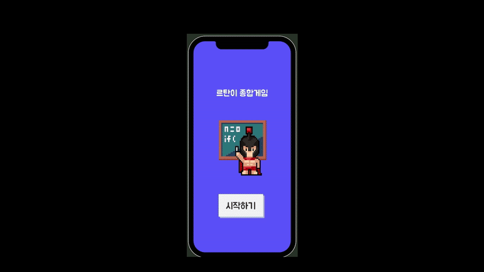

# SpartaMiniGame

> ⚙️ 내일배움캠프 Week 1~4 미니게임 통합 프로젝트

강의에서 제작한 4개의 미니게임을 하나로 연결하여 **스토리형 미니게임** 형태로 구성하였습니다.  
각 게임은 **Stage 형식**으로 진행되며, 모든 Stage를 차례로 클리어하면 게임이 종료되는 방식으로 구현했습니다.  
단순히 개별 미니게임 제작에 그치지 않고, 이를 하나의 흐름 속에 녹여 사용자에게 **연속적인 플레이 경험**을 제공하는 것이 특징입니다.

---
## 🎮 게임 화면 미리보기
 <td></td>

## 📌 시연 영상

[유튜브](https://www.youtube.com/watch?v=iigXHU1XzOI)

---

## 📦 개발 정보
-  **제작기간** 2025/04/09 ~ 2025/04/11 (3일)
- ⚙️ **언어**: C#
- 🎮 **엔진**: Unity 2022.x

